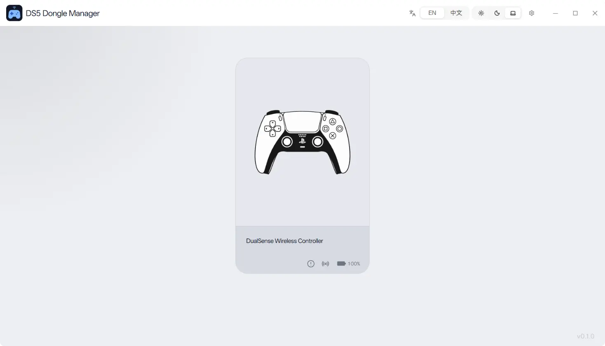
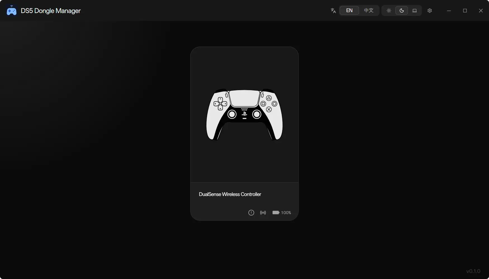
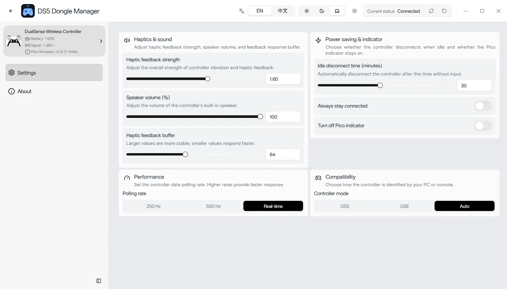
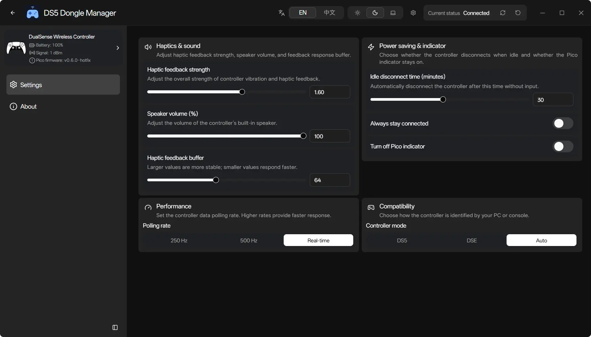

# DS5 Dongle Manager

[简体中文](README.zh-CN.md)

DS5 Dongle Manager is a desktop management tool for [awalol/DS5Dongle](https://github.com/awalol/DS5Dongle).

The upstream DS5Dongle project turns a Raspberry Pi Pico 2 W into a wireless adapter for the DualSense / DS5 controller. This project provides a graphical manager for connecting devices, viewing status, editing configuration, and saving settings to the device more conveniently.

## Features

- Automatically discover and connect DS5Dongle devices
- View battery, firmware version, serial number, and signal strength
- Read, apply, save, and reset dongle configuration
- Configure haptics, speaker volume, idle disconnect, Pico LED, polling rate, and controller mode
- Support 250 Hz, 500 Hz, and Real-Time polling rates, plus DS5, DSE, and Auto modes
- Check manager updates and notify when the latest DS5Dongle firmware is available from GitHub
- Support light/dark/system themes, English/Chinese UI, and controller battery display in the system tray

## Screenshots

<table>
  <tr>
    <td align="center">
      <strong>Main View - Light Theme</strong> 
      
    </td>
    <td align="center">
      <strong>Main View - Dark Theme</strong> 
      
    </td>
  </tr>
  <tr>
    <td align="center">
      <strong>Settings View - Light Theme</strong> 
      
    </td>
    <td align="center">
      <strong>Settings View - Dark Theme</strong> 
      
    </td>
  </tr>
</table>

## License

MIT
